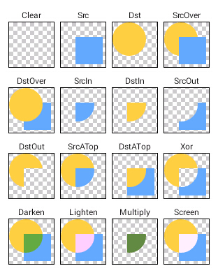
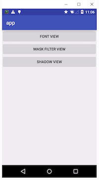
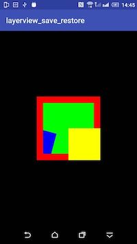
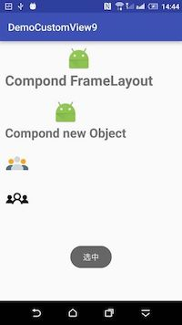

# SampleOfCustomView

## Demo1

use the Path

## Demo2

use the Paint：ColorMatrix、PorterDuffXfermode

踉踉跄跄中，终于完成了对Paint各种效果的练习。

收获非常多，对于Paint的各种过滤和混合效果，不再那么含糊和模棱两可，同时加深了对于矩阵的理解。

Demo中的各种示例均是在练习【aige】写的[文章](http://blog.csdn.net/aigestudio/article/details/41316141)。下面简单罗列下Demo中涉及到的知识点： 

### 矩阵

关于矩阵不清楚的童鞋可以转到[wiki](https://zh.wikipedia.org/wiki/%E7%9F%A9%E9%98%B5)

### ColorMatrixColorFilter

色彩矩阵过滤器，利用它可以实现很多美图秀秀中的效果，比如：变灰、变暗、颜色反转、老照片、高度对比等

### LightingColorFilter

`光照颜色过滤器，利用它可以实现的效果就像有色光照在物体上染色一样`

过滤掉绿色： 
mPaint.setColorFilter(new LightingColorFilter(0xFFFF00FF, 0x00000000));

### PorterDuffColorFilter

`混合颜色过滤器，可以通过指定一个颜色和一种模式，进行混合从而产生相应的效果`

红色+加深 混合： 
mPaint.setColorFilter(new PorterDuffColorFilter(Color.RED, PorterDuff.Mode.DARKEN));

### PorterDuffXfermode

这个是`最重量级 最重量级 最重量级`的东东了。ProterDuff是两个人名的组合: Tomas Proter和 Tom Duff. 他们是最早在SIGGRAPH上提出图形混合概念的大神级人物.有兴趣的童靴们可以自己查下并深入了解，在此不再做过多描述.

PorterDuffXfermode是一个非常强大的转换模式，通过它，可以使用图像合成的16条Porter-Duff规则的任意一条来控制Paint如何与已有的Canvas图像进行交互。

Demo中花了大量的篇幅练习和体会PorterDuffXfermode的强大，包括如下自定义view:
>
    PorterDuffView :基本练习
    DstInView：抠出美女轮廓
    DstOutView：挖出美女轮廓
    EraserView：橡皮擦练习

基本练习

使用DST_IN抠出美女图像，去掉了周围的黄色和顶部的文字

利用Path绘制路径，采用DST_IN混合模式，完成橡皮擦效果

## Demo3

use the Paint：Font、Shadow、MaskFilter

# Demo4

use the Paint：BitmapShader、LinearGradient、RadialGradient

# Demo5

use the Matrix：TextPaint、Path、PathMeasure

# Demo6

use the Canvas

# Demo7

use the OnMeasure

# Demo8

use the onMeasure

# Demo9

By combining a custom view

